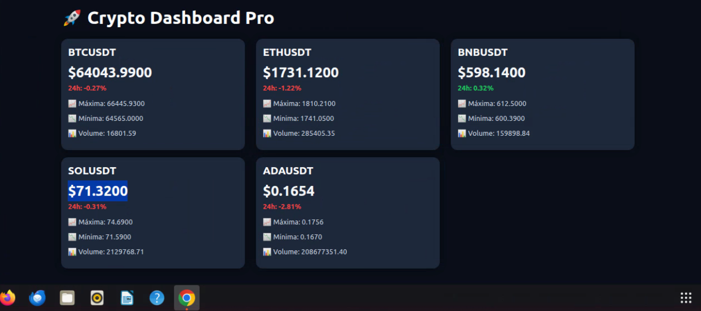

# 🚀 Crypto Dashboard Pro

## 📸 Screenshot



Dashboard profissional de criptomoedas desenvolvido em Python e Flask com integração em tempo real à API da Binance.

O projeto exibe preços atualizados, variação percentual das últimas 24 horas, máximas, mínimas e volume de negociação utilizando WebSockets e APIs REST.

---

## 📸 Funcionalidades

✅ Preços em tempo real via WebSocket Binance

✅ Dashboard responsivo com Bootstrap 5

✅ Atualização automática de preços

✅ Variação percentual das últimas 24h

✅ Máxima e mínima diária

✅ Volume negociado

✅ Interface moderna Dark Mode

✅ Integração com API Binance

---

## 🛠 Tecnologias Utilizadas

### Backend

* Python 3
* Flask
* Requests

### Frontend

* HTML5
* CSS3
* Bootstrap 5
* JavaScript

### APIs

* Binance REST API
* Binance WebSocket API

### Ferramentas

* Git
* GitHub
* Ubuntu Linux

---

## 📂 Estrutura do Projeto

crypto-dashboard/

├── app.py

├── requirements.txt

├── .gitignore

├── templates/

│ └── index.html

└── README.md

---

## ⚙️ Instalação Ubuntu 20.04+

### Atualizar o sistema

```bash
sudo apt update && sudo apt upgrade -y
```

### Instalar Python

```bash
sudo apt install python3 python3-pip python3-venv git -y
```

### Clonar o projeto

```bash
git clone https://github.com/danarcanjosilva/crypto-dashboard.git

cd crypto-dashboard
```

### Criar ambiente virtual

```bash
python3 -m venv venv
```

### Ativar ambiente virtual

```bash
source venv/bin/activate
```

### Instalar dependências

```bash
pip install -r requirements.txt
```

### Executar aplicação

```bash
python app.py
```

Abrir navegador:

```text
http://127.0.0.1:5000
```

---

## 📊 Dados Exibidos

* BTCUSDT
* ETHUSDT
* BNBUSDT
* SOLUSDT
* ADAUSDT

Informações:

* Preço Atual
* Variação 24h
* Máxima 24h
* Mínima 24h
* Volume

---

## 🔒 Segurança

O projeto utiliza apenas APIs públicas da Binance para consulta de mercado.

Nenhuma chave privada ou credencial é necessária para visualizar os dados.

Arquivos sensíveis são protegidos através do `.gitignore`.

---

## 🚀 Próximas Evoluções

* Gráfico BTC em tempo real (Chart.js)
* Top Gainers
* Top Losers
* Integração com carteira Binance
* Bot de Trading Simulado
* Deploy em produção
* Docker

---

## 👨‍💻 Autor

Daniel Arcanjo da Silva

Especialista em TI, Desenvolvimento Full Stack, Automação, APIs e Inteligência Artificial.

GitHub:

https://github.com/danarcanjosilva
